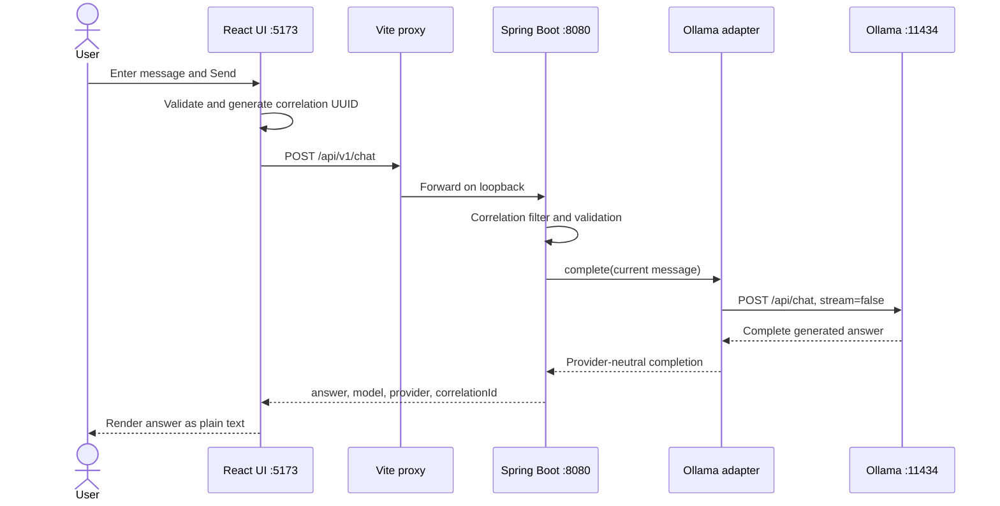

# Chat request-to-response flow

## Can MuniAI answer every question?

No. MuniAI can attempt general explanations, writing, brainstorming, and basic programming questions, but it cannot guarantee a correct answer. The current `llama3.2:3b` model generates likely text; it is not a verified source of facts.

### Current capabilities and limits

| Area | Current behavior |
|---|---|
| General questions | Can answer many common knowledge and explanation questions |
| Accuracy | May produce incorrect or invented information; verify important claims |
| Conversation context | **Not supported:** each request contains only the newest message |
| History | Shown temporarily in the current tab but not saved |
| Current information | No web search or live news, prices, schedules, or package data |
| Private documents | No upload, embeddings, or retrieval yet |
| Memory | No preferences or facts remembered across requests or sessions |
| External actions | No email, GitHub, calendar, or other connectors |
| Input | One text message, maximum 10,000 characters by default |
| Output | Text returned only after the complete answer is generated |
| Performance | CPU-only inference measured near 4.8 tokens/second |
| Timeout | Complete response must arrive within 120 seconds by default |

The UI displays earlier messages, but that display is not conversational memory. For example, after asking about Docker, a follow-up saying “explain the second point” will not send the Docker question or its answer to the model.

For faster results, ask a focused question and include a bound such as “answer in under 100 words.” Medical, legal, financial, security, and other high-stakes answers should be checked against authoritative sources.

## Runtime components

| Component | Local address | Responsibility |
|---|---|---|
| React UI | `127.0.0.1:5173` | Collects input and holds temporary display state |
| Vite proxy | `127.0.0.1:5173` | Forwards `/api` to the backend without broad CORS |
| Spring Boot API | `127.0.0.1:8080` | Validates, applies policy, maps errors, calls the provider |
| Ollama | `127.0.0.1:11434` | Runs `llama3.2:3b` locally |

The browser never calls Ollama directly.

## End-to-end sequence



### 1. React prepares the request

The form rejects blank or oversized input. It trims the message, places it in React component memory, disables additional sends, displays `Thinking locally`, and generates a UUID with `crypto.randomUUID()`.

The UI stores no chat data in cookies, `localStorage`, IndexedDB, or a database. Clear chat, refresh, or tab closure removes the visible history.

### 2. Browser and Vite proxy

The client sends:

```http
POST /api/v1/chat
Content-Type: application/json
X-Correlation-ID: generated-uuid

{"message":"Explain Docker networking in under 100 words."}
```

Vite forwards this request to `http://127.0.0.1:8080/api/v1/chat`. Keeping the browser request same-origin avoids adding a permissive CORS policy to the backend.

### 3. Spring Boot validates and correlates

The correlation filter accepts a safe incoming ID or generates one. It adds the ID to logging context, the response header, success responses, and error responses. Spring Validation rejects null or blank input, and `ChatApplicationService` enforces the configured maximum length.

Controllers only translate HTTP DTOs. Model access goes through the provider-neutral interface:

```java
public interface LanguageModelProvider {
    ChatCompletion complete(ChatCompletionRequest request);
    ProviderHealth health();
}
```

### 4. Ollama generates the answer

The adapter sends this conceptual payload to the local Ollama API:

```json
{
  "model": "llama3.2:3b",
  "messages": [
    {"role": "user", "content": "current message only"}
  ],
  "stream": false
}
```

Only the current message is included. There are no automatic retries. Because `stream` is false, the complete answer must be generated before the browser receives anything. The provider call is terminated after `OLLAMA_TIMEOUT_SECONDS`.

### 5. Success or failure returns to the UI

A successful public response is provider-neutral:

```json
{
  "answer": "Generated response",
  "model": "llama3.2:3b",
  "provider": "ollama",
  "correlationId": "generated-uuid"
}
```

React appends it to in-memory state and renders it as text, not raw HTML.

A slow response can produce a standard error:

```json
{
  "status": 504,
  "code": "AI_PROVIDER_TIMEOUT",
  "message": "The local AI provider timed out.",
  "path": "/api/v1/chat",
  "correlationId": "generated-uuid",
  "details": []
}
```

The UI shows the safe error and correlation reference; stack traces are never returned.

## Configuration

| Variable | Default | Purpose |
|---|---|---|
| `OLLAMA_BASE_URL` | `http://127.0.0.1:11434` | Local model API |
| `MUNIAI_CHAT_MODEL` | `llama3.2:3b` | Chat model |
| `OLLAMA_TIMEOUT_SECONDS` | `120` | Complete-response deadline |
| `MUNIAI_CHAT_MAX_MESSAGE_LENGTH` | `10000` | Backend input limit |

## Privacy and security

- Prompts and responses remain local by default.
- Frontend, backend, and Ollama use loopback addresses.
- Full prompts and answers are not logged.
- Model output is untrusted advisory text and grants no authority.
- No persistence, retrieval, long-term memory, authentication, tools, or connectors are active.

## Planned evolution

The implementation plan introduces persistence, document retrieval, memory, and approved connectors in later phases. Streaming and a configurable output-token limit would improve the current CPU experience, but neither is part of the currently verified request path.
