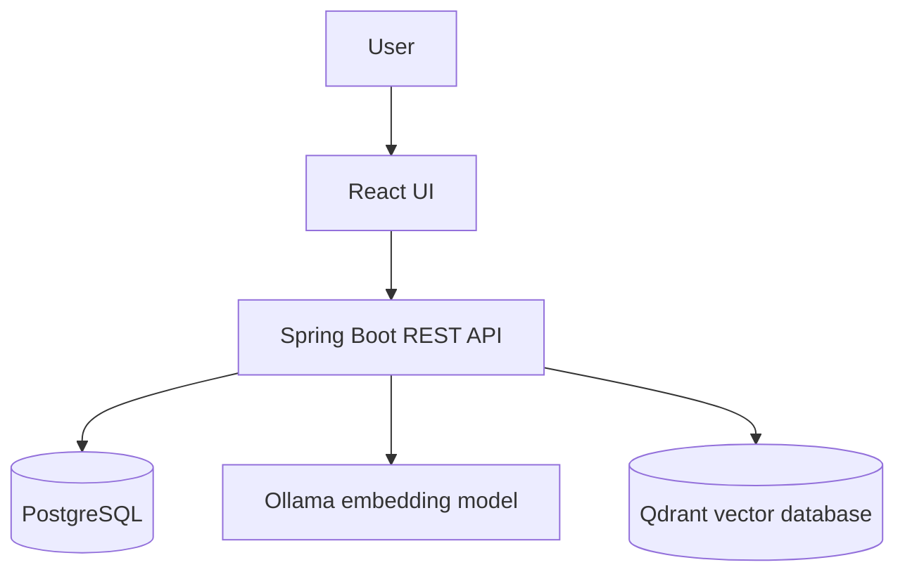
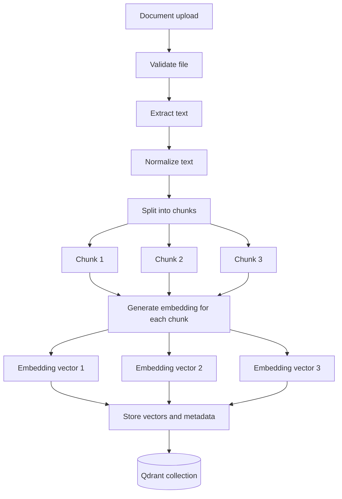
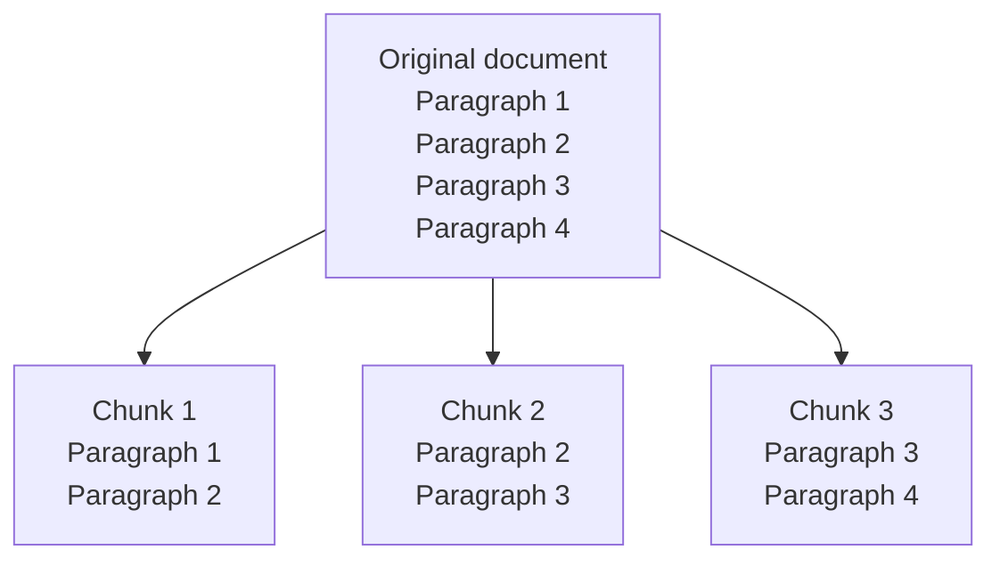
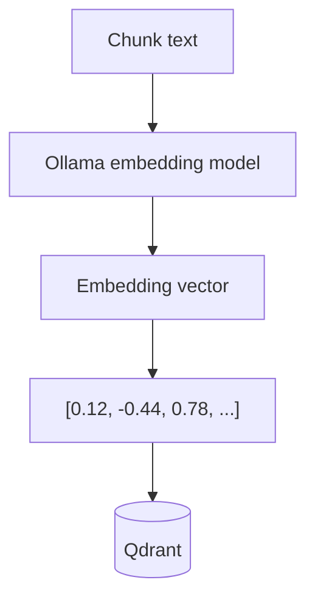
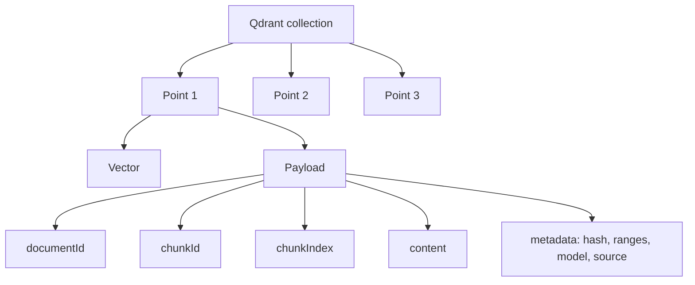
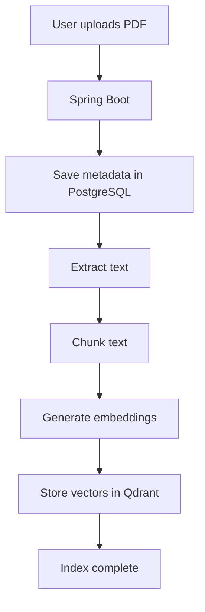
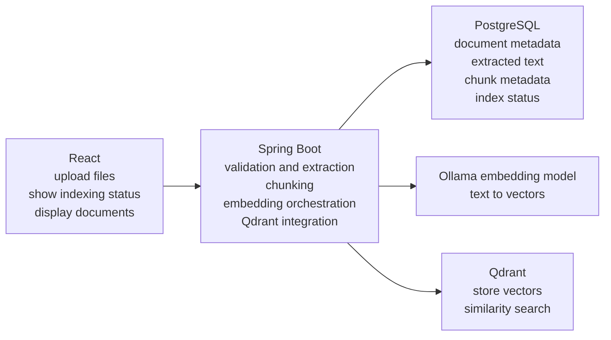

# Phase 6: document indexing and vectors

Phase 6 turns already-extracted text into searchable numeric vectors. It does **not** connect search results to chat; grounded answers and citations belong to Phase 7.

## Four important terms

- **Extracted text** is readable text obtained from the uploaded file.
- A **chunk** is a smaller, ordered, overlapping passage cut from that text.
- An **embedding** is a list of numbers produced by a model to represent the meaning of a passage.
- A **vector** is that numeric list after it is stored and made searchable in Qdrant.

The chat model writes language. The dedicated `nomic-embed-text` model converts text into vectors; it does not write answers.

## 1. High-level Phase 6 architecture



```text
User
  |
  v
React UI
  |
  v
Spring Boot REST API
  |-- PostgreSQL
  |-- Ollama embedding model
  `-- Qdrant vector database
```

| Component | Why it exists | Input | Output |
|---|---|---|---|
| User | Starts and inspects indexing | Upload/index/search action | An explicit request |
| React | Presents safe controls and status | User action and API JSON | Validated request and rendered status |
| Spring Boot | Enforces workflow and consistency | REST request, extracted text | Status updates, chunks, embedding calls, vector operations |
| PostgreSQL | Authoritative traceability | Document and chunk metadata | Durable rows and indexing state |
| Ollama embedding model | Converts meaning into numbers locally | Chunk or diagnostic query text | Fixed-size embedding vector |
| Qdrant | Performs vector similarity lookup | Vector plus safe payload | Stored point or ranked matches |

## 2. Document indexing flow



```text
Upload -> validate -> extract -> normalize -> split
                                          |-- Chunk 1 -> Vector 1 --|
                                          |-- Chunk 2 -> Vector 2 --+-> Qdrant collection
                                          `-- Chunk 3 -> Vector 3 --|
```

Validation keeps unsafe files out. Extraction supplies readable input. Normalization removes repeated whitespace. Splitting keeps requests small and traceable. Embedding supplies one fixed-size vector per chunk. Storage combines each vector with source metadata so a later result can be traced back to its document.

## 3. Chunking visualization



```text
Original:  [Paragraph 1][Paragraph 2][Paragraph 3][Paragraph 4]
Chunk 1:   [Paragraph 1][Paragraph 2]
Chunk 2:                 [Paragraph 2][Paragraph 3]
Chunk 3:                               [Paragraph 3][Paragraph 4]
                           ^ overlap ^    ^ overlap ^
```

Input is normalized extracted text. Output is ordered chunk records with stable indexes, SHA-256 content hashes, character ranges, and approximate token counts. Overlap repeats context near boundaries so a useful idea is less likely to be cut in half. Defaults are 1,000 characters with 150 characters of overlap; boundaries prefer paragraphs and then whitespace rather than splitting a word.

## 4. Embedding generation flow



```text
Chunk text -> Ollama/nomic-embed-text -> [0.12, -0.44, 0.78, ...] -> Qdrant
```

The input is private chunk text. Ollama runs locally and returns 768 floating-point values by default. The backend rejects an empty vector or a dimension other than the configured value. Qdrant receives the validated vector; neither full content nor vectors are logged.

## 5. Qdrant storage structure



```text
Qdrant collection
|-- Point 1
|   |-- Vector: [numbers...]
|   `-- Payload
|       |-- documentId
|       |-- chunkId
|       |-- chunkIndex
|       |-- content
|       `-- metadata
|-- Point 2
`-- Point 3
```

Each input point contains one stable UUID, one vector, and one payload. The output is a searchable record. Payload includes safe source identifiers, original display name, content type, chunk text/hash, character range, token estimate, embedding model, and creation time. It never contains a filesystem path. PostgreSQL remains authoritative; Qdrant can be rebuilt.

## 6. End-to-end Phase 6 flow



```text
User uploads PDF
  -> Spring Boot
  -> PostgreSQL metadata
  -> extracted text
  -> chunks
  -> Ollama embeddings
  -> Qdrant vectors
  -> COMPLETED
```

The upload produces extracted text first. Indexing is a separate explicit action. During indexing the backend moves through `PROCESSING`, performs external calls without holding one long database transaction, verifies Qdrant’s point count, then writes `COMPLETED`. Failures become `FAILED`; partial chunks and points are cleaned up where possible and retry remains available.

## 7. Responsibilities



```text
React       : upload | status | document list | diagnostic search
Spring Boot : validate | extract | chunk | orchestrate | compensate
PostgreSQL  : authoritative documents | text | chunks | status
Ollama      : text -> embedding vector
Qdrant      : vector + payload -> stored/ranked points
```

React accepts user input and outputs safe UI state. Spring Boot accepts API actions and outputs coordinated local operations. PostgreSQL accepts structured state and outputs durable source records. Ollama accepts text and outputs vectors. Qdrant accepts points or query vectors and outputs persistence or similarity-ranked chunks.

## Failure, retry, and deletion

Index and re-index first delete prior points and chunk rows, preventing duplicates. Midway embedding/Qdrant failure triggers best-effort vector cleanup, chunk cleanup, and `FAILED`. Retry repeats the replacement workflow. Removing an index leaves the uploaded file and extracted text. Deleting an indexed document first removes Qdrant points, then its file and PostgreSQL record; Qdrant failure is reported rather than silently creating an orphan.

## Known limitations

Chunk size is measured in characters, not exact model tokens. Embeddings are currently requested sequentially and upserted in bounded batches. Diagnostic search returns previews only. There is no reranking, hybrid search, automatic retrieval, document-aware response, grounded prompt, or citation generation in Phase 6.
