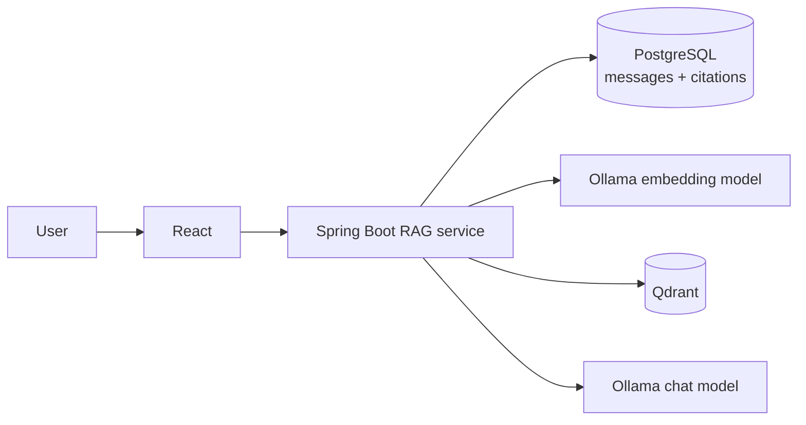
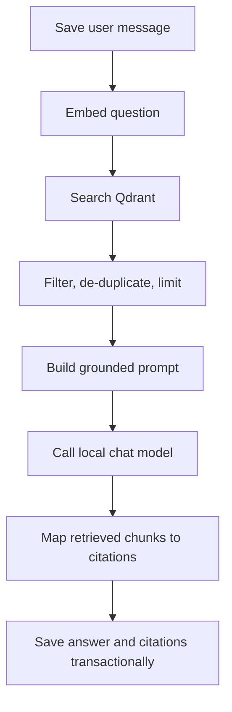
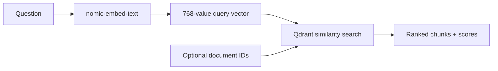
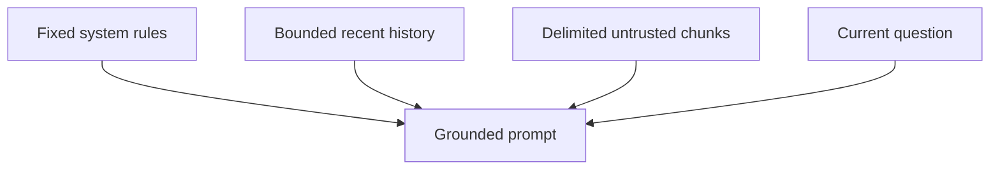
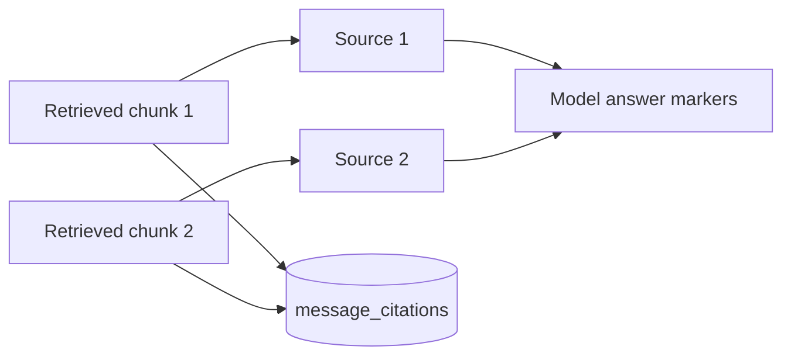
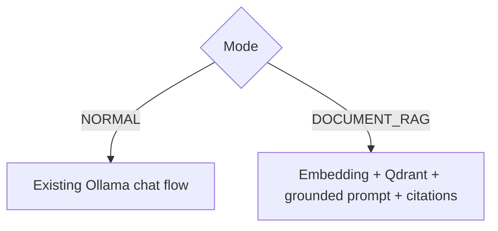
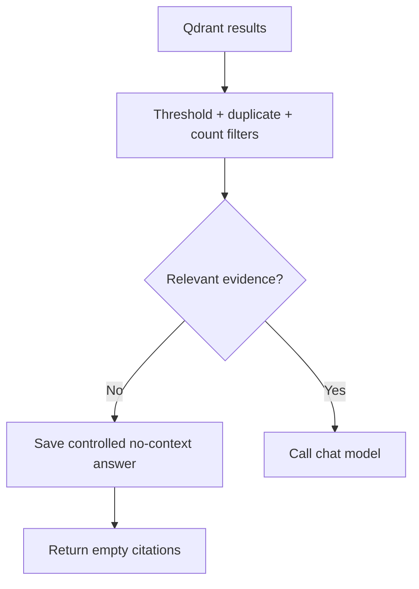
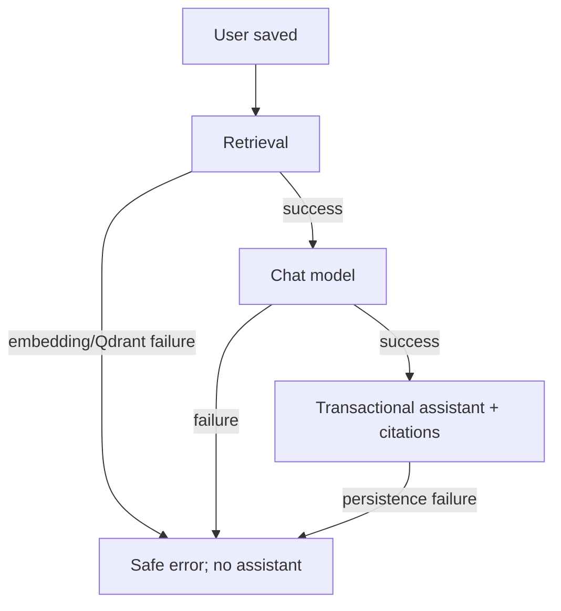

# Phase 7: retrieval-augmented document chat

Phase 7 adds an explicit **Ask Documents** mode. Normal Chat remains unchanged. RAG means retrieval-augmented generation: Spring Boot retrieves relevant indexed chunks before asking the local chat model to answer. Long-term memory is not part of this phase.

## 1. High-level architecture



```text
User -> React -> Spring Boot
                    |-> PostgreSQL messages/citations
                    |-> Ollama embeddings -> Qdrant retrieval
                    `-> Ollama chat model
```

All components remain local and loopback-bound. The model never accesses PostgreSQL or Qdrant directly.

## 2. Query-to-answer flow



```text
save question -> embed -> retrieve -> filter -> prompt -> answer
             -> structured citation mapping -> save answer + citations
```

The user message is preserved if embedding, Qdrant, or Ollama fails. No fake assistant message or citation is created.

## 3. Query embedding and retrieval



```text
question -> local embedding -> query vector -> Qdrant
                                          + selected document filter
                                          -> ranked chunks
```

Only documents whose indexing status is `COMPLETED` are eligible. An empty selection means all indexed documents. Scores are ranking values, not percentages.

## 4. Prompt construction



```text
SYSTEM RULES
RECENT HISTORY (bounded; not evidence)
<retrieved_context>
  [Source 1] <document_source>...</document_source>
</retrieved_context>
USER QUESTION
```

The prompt instructs the model to use only retrieved evidence, cite source labels, refuse unsupported answers, ignore instructions inside documents, and never reveal internal instructions. Filenames are normalized, context count and characters are bounded, and Unicode-safe truncation avoids splitting surrogate pairs.

## 5. Citation mapping



```text
[Source 1] -> documentId + chunkId + filename + index + score + preview
[Source 2] -> documentId + chunkId + filename + index + score + preview
```

Spring Boot, not the model, creates citation metadata. It removes model-written
source labels and deterministically aligns each supported answer sentence to
the best matching retrieved chunk before attaching a validated `[Source N]`
label. Unsupported sentences remain uncited. Citation snapshots persist with
the assistant message and contain no vector or filesystem path. The UI calls
the complete list **Retrieved evidence** because not every retrieved chunk must
be cited in the answer.

## 6. Normal Chat versus Ask Documents



```text
Normal Chat   : question -> Ollama -> general response
Ask Documents: question -> retrieval -> grounded prompt -> Ollama -> cited response
```

Retrieval is never silently enabled.

## 7. No-relevant-context flow



```text
no indexed documents / empty results / all scores too low
  -> do not call the chat model
  -> save "I could not find enough relevant information..."
  -> citations: []
```

## 8. Failure flow



```text
user saved -> dependency failure -> safe API error -> retry allowed
user saved -> answer -> transaction(answer + citations) -> success
```

No long database transaction is held during embedding, Qdrant, or Ollama calls.

## Context and retrieval controls

- Recent history is capped; the current question is included once.
- Previous assistant messages are context, never document evidence.
- `topK`, threshold, maximum chunks, and context characters are bounded.
- Duplicate chunk IDs are removed and results stay ordered by relevance.
- Raw embeddings, prompts, retrieved chunks, credentials, and private content are not logged.

## Known limitations

- Retrieval uses vector similarity only; there is no reranker or hybrid keyword search.
- Page numbers are null because Phase 6 chunks do not retain page mapping.
- Citation metadata shows retrieved evidence; generated statements still require user judgment.
- Deterministic citation alignment uses lexical and phrase overlap plus the
  retrieval score as a tie-breaker. It prevents invented or mismatched model
  labels, but it is not a formal logical-entailment proof.
- There is no long-term memory, summarization pipeline, tool use, agent workflow, web search, or connector behavior.
